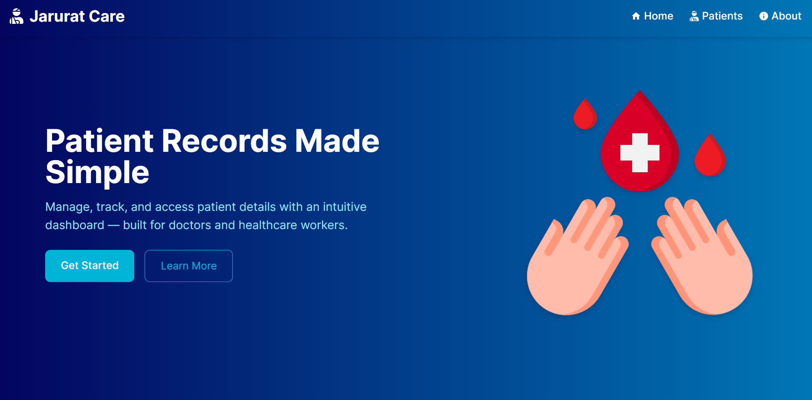

# 📋 Jarurat Care – Patient Records Dashboard

## Description

A modern **patient records dashboard** built with **React + Tailwind CSS**, featuring:  
✅ Responsive UI  
✅ Patient search & details modal  
✅ Add new patients (local state only)  
✅ Loading & error handling for API fetch  
✅ Gradient UI design with color palette from [Coolors](https://coolors.co/palette/03045e-023e8a-0077b6-0096c7-00b4d8-48cae4-90e0ef-ade8f4-caf0f8) 

## Table of Contents 

- [Installation](#installation)
- [Preview](#preview)
- [Features](#features)
- [Tech Stack](#tech)

## Installation

1️⃣ Clone the repo
git clone https://github.com/sanjana-1604/jarurat-care.git
cd jarurat-care

2️⃣ Install dependencies
npm install
npm i react-router
npm install --save react-icon
npm install tailwindcss @tailwindcss/vite

3️⃣ Run the app
npm start

App runs on 👉 http://localhost:3000

## 📸 Preview  
  

## ⚡ Features  
- 🏥 **Landing Page** with hero section & feature highlights  
- 👨‍⚕️ **Patients Page** with:  
  - API fetch (JSONPlaceholder mock data)  
  - Search by name  
  - Patient cards in a grid layout  
  - Modal for details  
  - Add New Patient form (local update only)  
  - Loading & error states  
- ℹ️ **About Page** with project info  
- 🌈 **Responsive, modern UI** with gradients & Tailwind styling  

## 🛠️ Tech Stack  
- **React** (Hooks + Context API)  
- **Tailwind CSS** for styling  
- **React Router** for navigation  
- **React Icons** for UI icons
